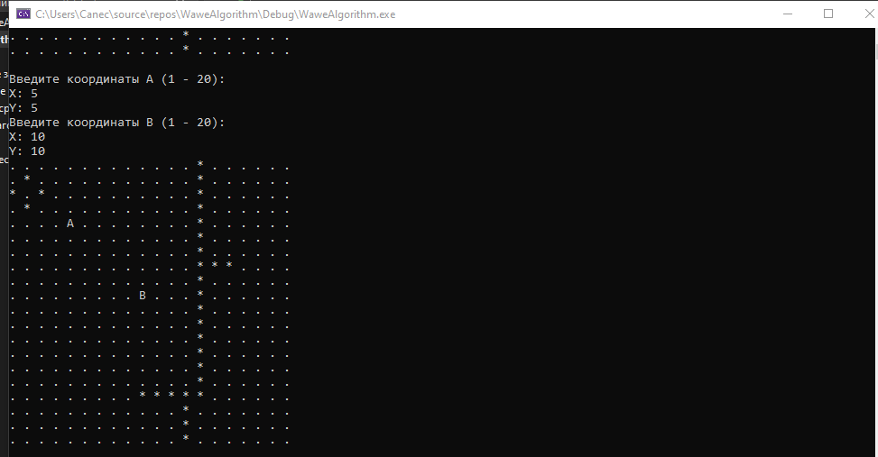
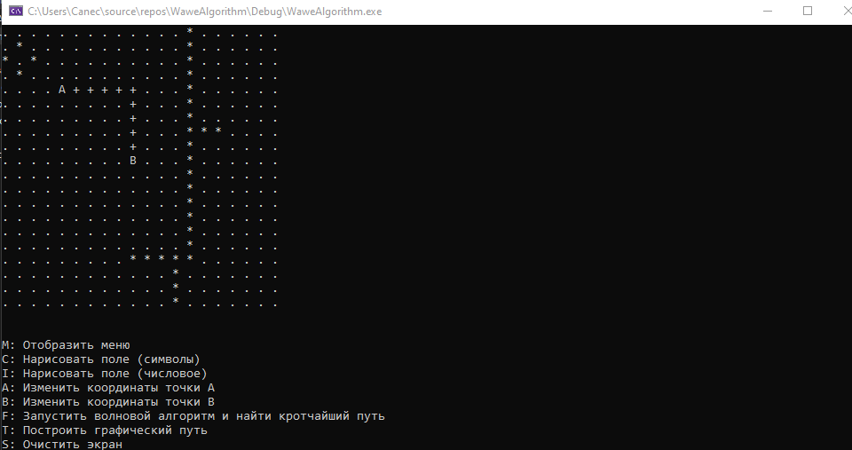
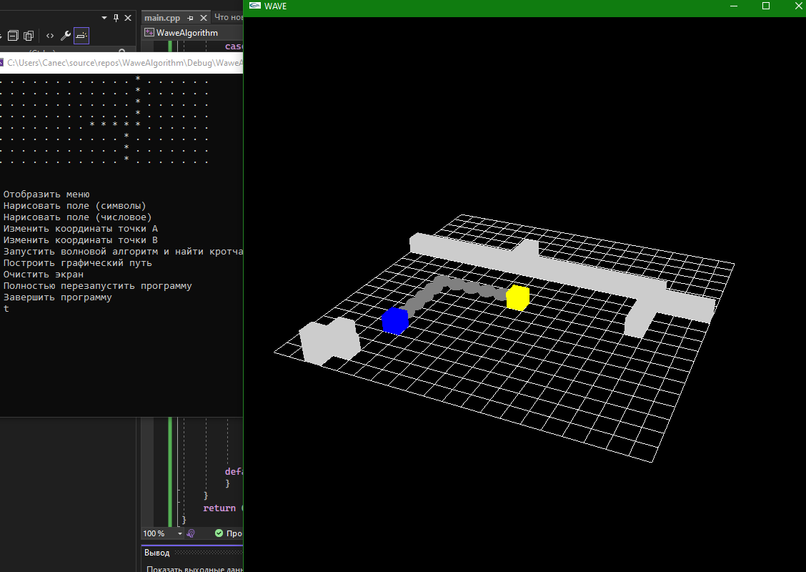
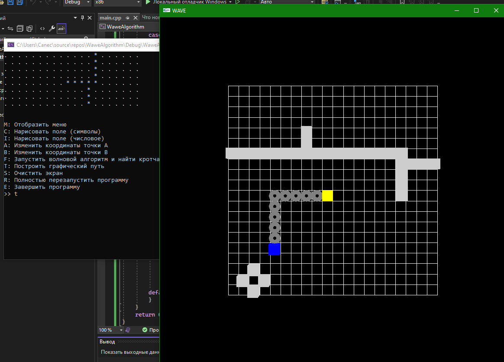

# LeesAlgorithmOpenGL
Волновой Алгоритм (Алгоритм Ли) с визуализацией через OpenGL

- На заранее отрисованном поле пользователю предлагается выбрать координаты точки `А` (начало) и `В` (конец)
- От точки `А` запускается "волна" по всему полю
- От точки `В` строится обратный путь к точке `А`
- Алгоритм завершен. Кратчайший путь найден

